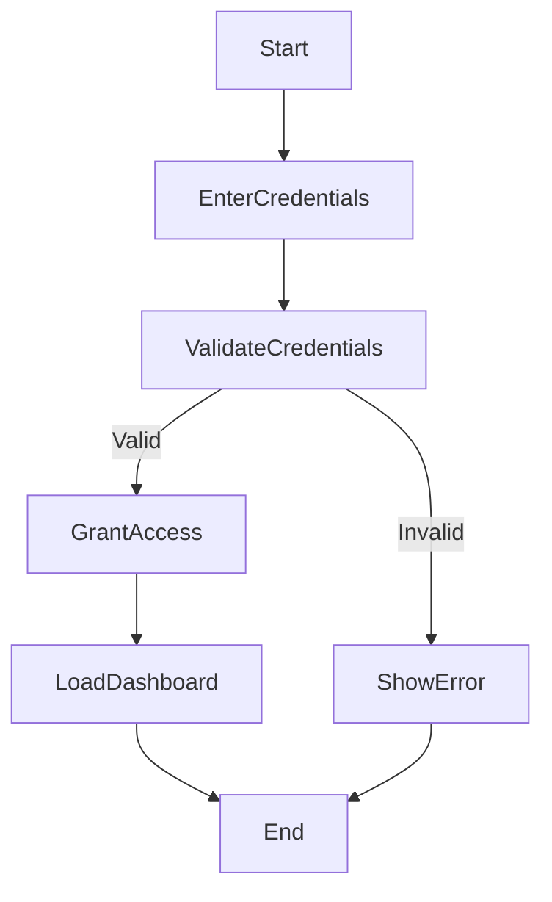
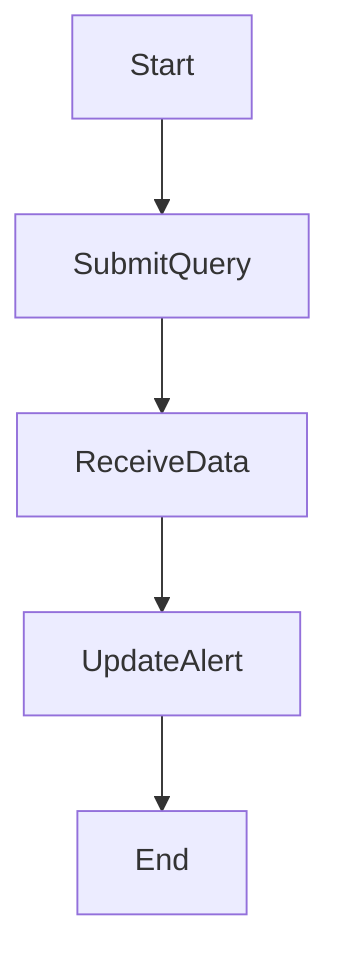
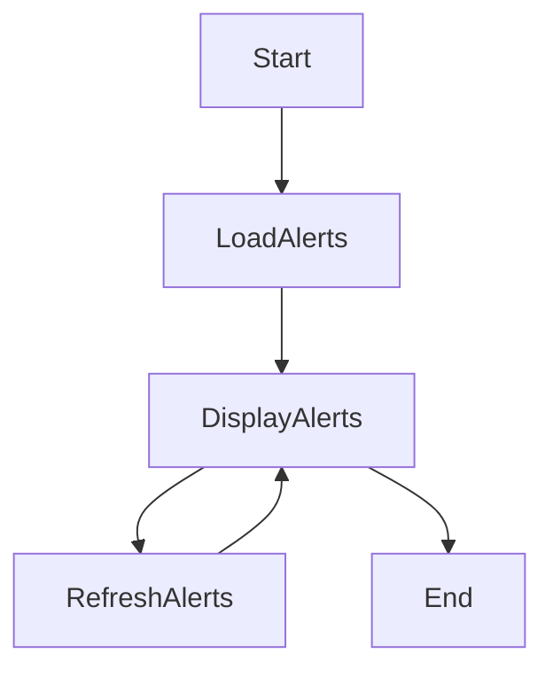
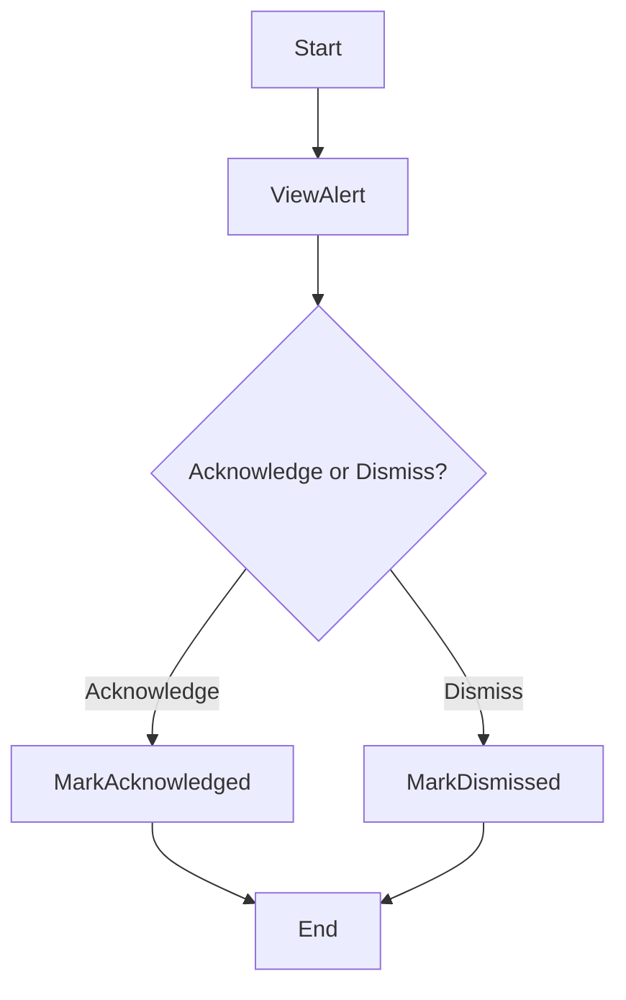
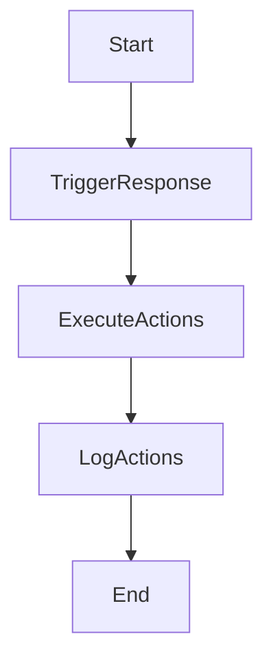
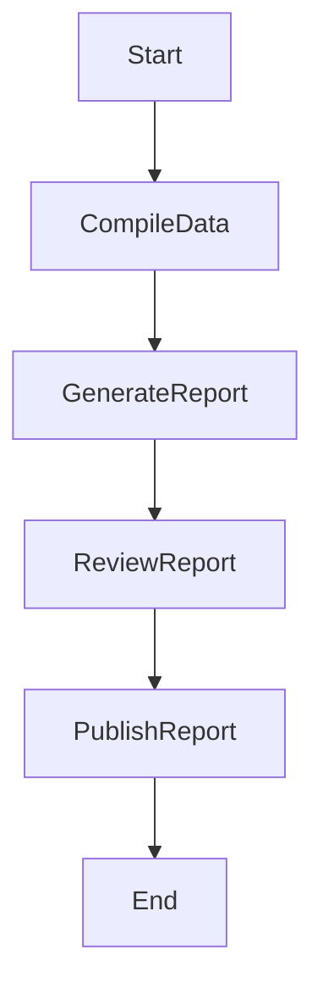

# User Login

    
Explanation:

Workflow: Analyst enters username, password, and customer ID. System validates credentials. If valid, access is granted and the dashboard loads; if invalid, an error is shown.

Stakeholder Concern: Ensures only authorized analysts can access sensitive alerts and logs.

Traceability: FR-7 (provide a dashboard for analysts to view alerts).


# Log Ingestion
```mermaid
flowchart TD
    Start --> CollectLogs
    CollectLogs --> NormalizeFormat
    NormalizeFormat --> StoreLogs
    StoreLogs --> End

    ```
Explanation:

Workflow: Logs collected, normalized, stored.

Stakeholder Concern: Scalability for enterprise servers.

Traceability: FR-1 (ingest logs), FR-2 (parse logs), FR-6 (store logs).

# Alert Generation
```mermaid
flowchart TD
    Start --> ApplyRules
    ApplyRules -->|Anomaly| GenerateAlert
    ApplyRules -->|No anomaly| End
    GenerateAlert --> StoreAlert
    StoreAlert --> End

```
Explanation:

Workflow: Detection rules applied, anomalies trigger alerts.

Stakeholder Concern: Timely detection of threats.

Traceability: FR-3 (apply rules), FR-5 (generate alerts), FR-6 (store alerts).

# VirusTotal Enrichment

Explanation:

Workflow: Suspicious event enriched with VirusTotal data.

Stakeholder Concern: Analysts need context for decisions.

Traceability: FR-4 (query VirusTotal API).

# Dashboard Viewing

Explanation:

Workflow: Alerts loaded, displayed, refreshed.

Stakeholder Concern: Real‑time visibility.

Traceability: FR-7 (dashboard for analysts).

# Alert Acknowledgement/Dismissal

Explanation:

Workflow: Analyst decides to acknowledge or dismiss.

Stakeholder Concern: Control over alert triage.

Traceability: FR-8 (acknowledge/dismiss alerts).

#  Automated Response Workflow

Explanation:

Workflow: Response triggered, actions executed, logged.

Stakeholder Concern: Fast mitigation with audit trail.

Traceability: FR-9 (trigger workflows), FR-10 (log actions).

# Report Generation

**Explanation:**

Workflow: Data compiled, report generated, reviewed, published.

Stakeholder Concern: Transparency for stakeholders.

Traceability: FR-10 (log/report automated actions).