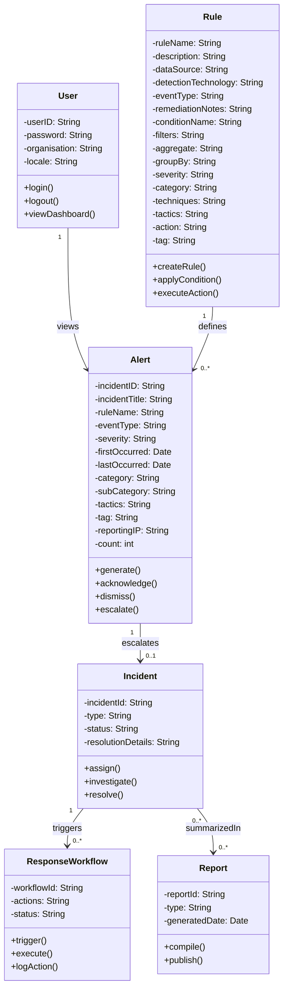

# Class Diagram – SIEM Domain Model

### Design Decisions
- User simplified to only core authentication and organisational attributes.  
- Alert expanded with detailed incident metadata (severity, tactics, reporting IP, etc.).  
- Rule modeled in three logical steps (General, condition, action) but kept in one class for readability.  
- Incident escalates from Alerts and triggers ResponseWorkflows.  
- Reports summarize Incidents for audit and compliance.  

---
