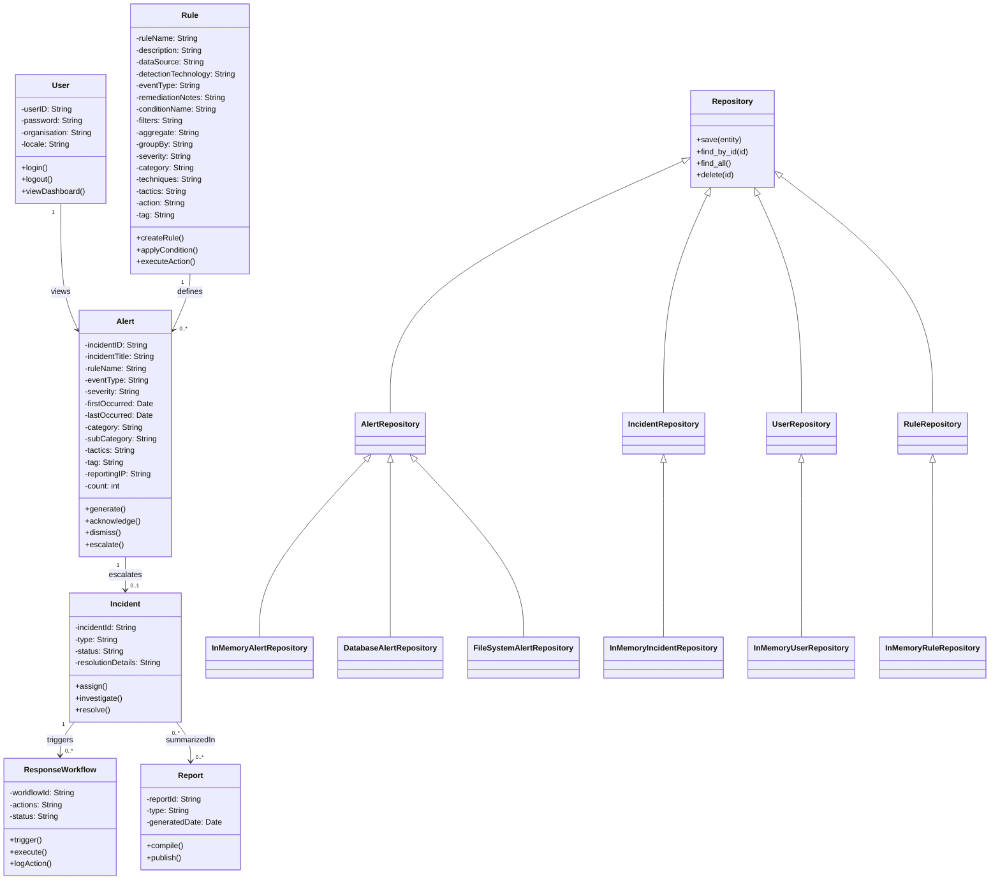

# Class Diagram – SIEM Domain Model

### Design Decisions
- User remains simplified to core authentication and organisational attributes, ensuring clarity and avoiding      unnecessary complexity.
- Alert is expanded with detailed incident metadata (severity, tactics, reporting IP, etc.) to support richer detection and escalation workflows.
- Rule is modeled in three logical steps (metadata, condition, action) but kept in one class for readability and easier maintenance.
- Incident escalates from Alerts and triggers ResponseWorkflows, reflecting the operational flow of SIEM systems.
- Reports summarize Incidents for audit and compliance, ensuring traceability.
- Repository Interfaces abstract CRUD operations for each entity, enforcing consistent contracts and decoupling domain logic from storage.
- In-Memory Implementations provide working HashMap‑based storage for testing and current functionality.
- Future Stubs (Database, FileSystem) are included to demonstrate extensibility and future-proofing, raising NotImplementedError until implemented.
- This layered design balances simplicity, maintainability, and scalability, ensuring the SIEM domain model can evolve with new storage backends while remaining testable and robust. 

---
